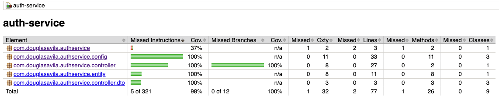
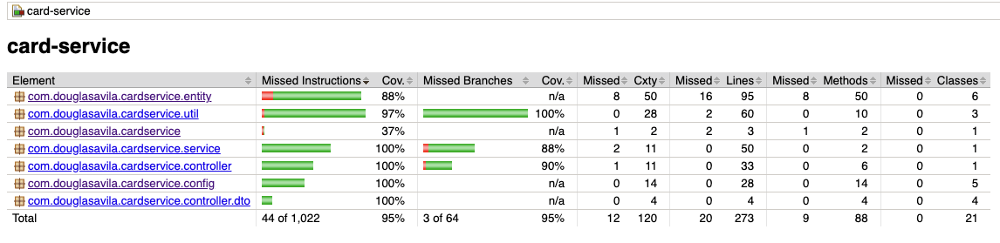
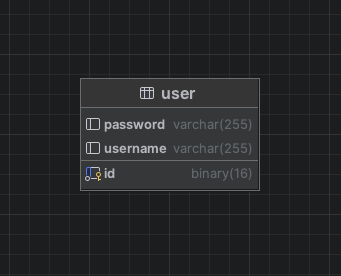
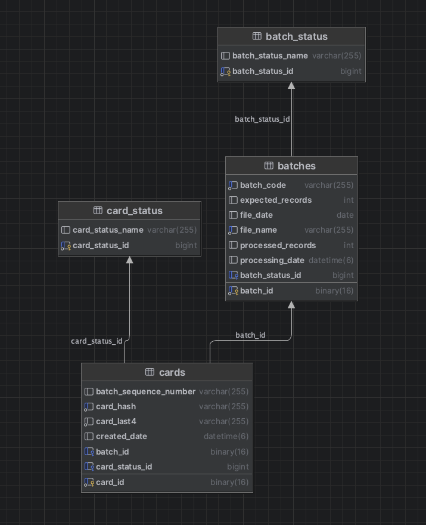

# Card Platform
This project contains 2 services splited as:
- `auth-service` which contains it's own database `auth_db` and is responsible for client's login and authentication.
- `card-service` which contains it's own database `card_db` and is responsible for handling card operations.


## Running the Project
### Starting the Services

From the project root directory, run the following Docker command to start all services:
```
docker-compose up -d
 
```

### Stopping the Services

To stop all services and remove ephemeral keys, run:
```
docker-compose down -v
```
The -v flag is essential to remove the generated RSA keys. When the containers are started, docker-compose runs a keygen container that generates the API private and public keys to be used by the services. To ensure these keys are properly deleted, you must use the -v parameter when executing docker-compose down -v. Simply terminating a running docker-compose session with Ctrl + C will not remove these keys.


# API Documentation

Once the services are running, the API documentation is available at:
- auth-service: http://localhost:8080/docs
- card-service: http://localhost:8081/docs

# Using the Card Platform

## Authentication

Use the following endpoint to authenticate with the Card Platform and obtain a valid JWT token that must be used to authorize card operations:
```
POST http://localhost:8080/login
```
Request body:
```
{
    "username": "John",
    "password": "123"
}
```
The response will contain a valid JWT token for the Card Platform.
If you use the Authentication request from the Insomnia collection under **/docs-api, the token will automatically populate an Insomnia environment variable, and you will not need to manually copy and paste it into subsequent requests. Otherwise, you must copy the token and include it as a Bearer token in the Authorization header for each request.
Each token is valid for 300 seconds (5 minutes). After this period, you must generate a new token. A token refresh mechanism has not been implemented in order to reduce the project scope and development time.


## Add Card

Use this endpoint to register a single card by providing only its card number:
```
POST http://localhost:8081/card
```
Request body (you may provide your own card number, following standard card formatting conventions):
```
{
    "cardNumber": "4456897999999942"
}
```
The project performs basic card number validation and will only accept the card if it is considered valid.
Note: Luhn validation is not implemented in order to simplify testing.


## Get Card ID

Use this endpoint to retrieve a card ID. Note that this is not the card number itself; the returned value is the card’s UUID, which is used internally by the Card Platform:
```
GET http://localhost:8081/card
```
Request body (specify the card number you want to query):
```
{
    "cardNumber": "4456897999999999"
}
```
If the card exists, the endpoint will return the card’s internal UUID. If it does not exist, the endpoint will indicate that the card does not exist.


## Add Cards from Batch File

Use this endpoint to add multiple cards using a batch file that follows the template located at:
**/samples/CARD-PROCESSING-BATCH.txt
```
POST http://localhost:8081/cards
```
Request body:
- Form Data
	- file: \<path-to-your-batch-file\>

If not all cards in a batch file are successfully processed, the batch will be marked with the status PARTIALLY_PROCESSED. This means you can resend the same batch (after correcting the invalid card entries), and the system will process it again. During reprocessing, the system will only insert the previously invalid cards and skip the cards that were already successfully inserted.


# API Usage Logs

The project includes API usage logs at the INFO level, which record interactions with API endpoints, for example:
```
... API_USAGE - method=POST path=/cards status=200 contentType=text/plain;charset=UTF-8
```
To view these logs, connect to one of the service containers (auth-service or card-service). The API usage INFO logs will appear in the container logs as requests are processed.


# Local Debug / Development

To run the project directly from your local environment (without Docker containers), you must generate a private and public RSA PKCS#8 key pair and place them in the following files:
```
Private key:
    auth-service: **/src/main/resources/app.key
 
Public key:
    auth-service: **/src/main/resources/app.pub
    card-service: **/src/main/resources/app.pub
```

## Generating RSA PKCS#8 Private and Public Keys for Local Development

On a Linux/Mac terminal, run the following commands. They will generate the app.key (private key) and app.pub (public key) files.
Note: Native Windows terminals may require different commands; however, the commands below should work under WSL.
Generate the private key (must be created first):
```
openssl genpkey -algorithm RSA -out app.key -pkeyopt rsa_keygen_bits:2048
```
Generate the public key (derived from the previously generated private key):
```
openssl rsa -pubout -in app.key -out app.pub
```


# Test Automation

The Card Platform project includes Spring + JUnit test cases for both auth-service and card-service.
To execute the tests, run the default Maven test command inside each service directory:
```
mvn clean test
```
The repository also includes JaCoCo test coverage analysis. After running the tests, open the generated HTML report at:
```
**/target/site/index.html
```
At the time of this project’s deployment, the code coverage was:
- auth-service: 98%
- card-service: 95%




# Database

This project uses two databases:
- auth_db, containing the table:
	- user: Stores usernames and passwords used during client authentication for JWT token generation.
	  
	   The password is OAuth2-encrypted and protected using modern Java + Spring Security strategies.
- card_db, containing the tables:
	- cards: Stores card-related data. It uses a hashing + salt strategy to protect sensitive client data while allowing deterministic lookups via hash. It has a many-to-one relationship with batches and a many-to-one relationship with `cards_status`.
	- cards_status: Has a one-to-many relationship with the cards table and stores card statuses: VALID, INVALID, EXPIRED.
	- batches: Stores data related to batch files received and processed by the /cards endpoint. It has a one-to-many relationship with cards and a many-to-one relationship with `batch_status`.
	- batch_status: Has a one-to-many relationship with the batches table and stores batch statuses: RECEIVED, PROCESSED, PARTIALLY_PROCESSED, FAILED.

## Accessing the Databases

With the service containers running, connect to the databases using the following settings:

auth_db

```
Host: localhost
Port: 3306
User: admin
Password: 123
Database: auth_db
```

card_db

```
Host: localhost
Port: 3307
User: admin
Password: 123
Database: card_db
```

## Database Diagram
### auth_db

### card_db



